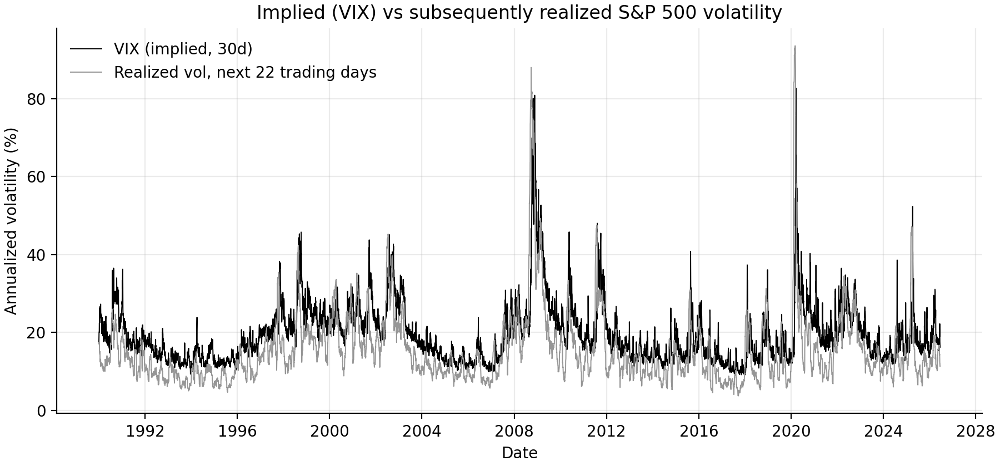
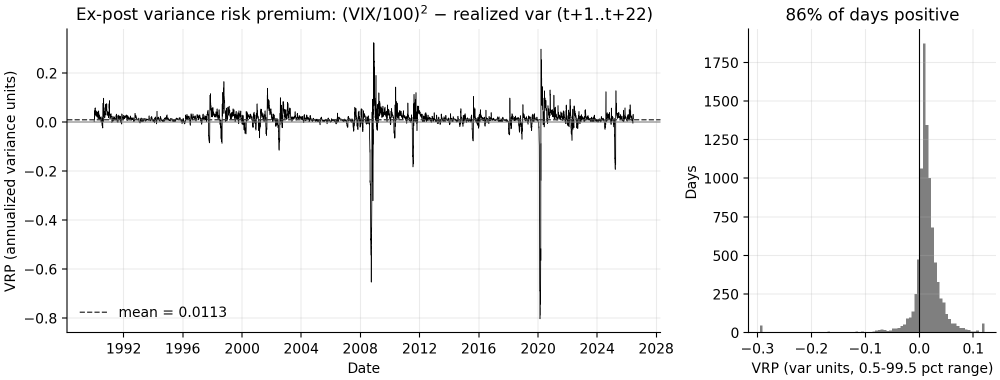
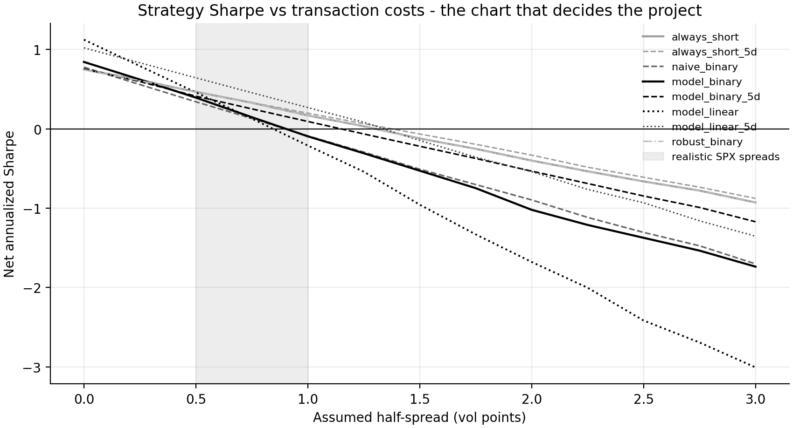
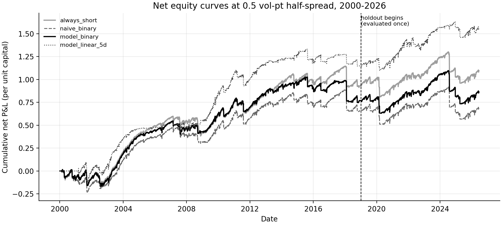
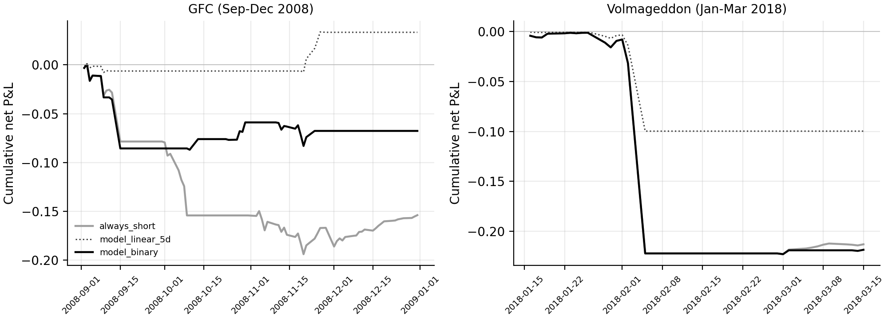
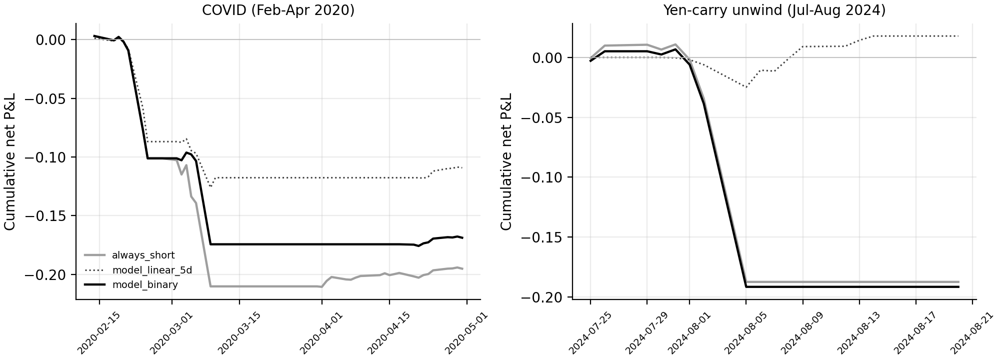

# Volatility forecasting and the variance risk premium

Does a realized-volatility forecast add economic value over simply always being short S&P 500 variance, after realistic transaction costs?

No, not measurably. The premium survives costs: always-short nets Sharpe 0.47 on the 2000-2018 dev period and 0.19 on the untouched 2019-2026 holdout, at a 0.5 vol-point half-spread. Conditioning on a forecast wins on point estimate in both (0.64 and 0.49), but the gap is insignificant (HAC p = 0.42 and 0.34) and its deflated Sharpe against the 66 configurations logged here is 0.51, a coin flip. What conditioning does deliver is tail shape: holdout max drawdown -17.7% vs -34.2%, skew -3.3 vs -7.5, and it sat out the August 2024 yen-carry unwind (+1% vs -19%).

So the VRP is harvestable, this forecast adds no defensible alpha on top, and its real contribution is risk control. Walk-forward throughout, holdout touched once.

## 1. Data

| Series | Source | Notes |
|---|---|---|
| VIX, VIX9D, VIX3M, VIX6M daily OHLC | CBOE (`cdn.cboe.com`, free) | from 1990-01-02 under the current (2003) methodology; the Oct-2014 inclusion of SPX weeklys is a regime caveat, not a series break |
| S&P 500 (^GSPC), SPY daily OHLCV | Yahoo v8 chart API | pulled from 1985; joint sample starts 1990 with VIX |
| S&P 500 (^SPX) | Stooq | independent close cross-check only (optional) |

`python3 scripts/download_raw.py` (stdlib-only) writes `data/raw/` with a manifest of URL, sha256, row counts, and timestamps. `src/` never touches the network. 9,198 joint trading days, 1990-01-02 to 2026-07-17.

No 5-minute RV: the Oxford-Man library was discontinued and free intraday history spans about 60 days. Daily data has two consequences. Target and payoff use close-to-close squared log returns, matching a variance swap's floating leg, so the proxy is noisy but unbiased and payoff-exact. QLIKE is the primary loss because it is robust to proxy noise (Patton 2011), where MSE is not.

Range estimators (Parkinson, Garman-Klass, Rogers-Satchell, Yang-Zhang) are features and cross-checks only. Data problems, all handled in code:

- CBOE's published VIX history violates OHLC relations on 47 rows (e.g. 1992-02-11 open 19.24 > high 18.57), plus 1 each in VIX3M/6M. We use closes only; bad fields are counted, not silently dropped.
- Yahoo ^GSPC opens are synthetic (equal to prior close) on 50-98% of days per year through 2005, clean from ~2008. Every row carries `spx_open_synthetic`, and the ML feature set uses only Parkinson among range estimators. Parkinson vs close-to-close means (14.6 vs 18.0 vol pts) match the expected overnight gap.
- Only calendar anomaly is the 9/11 closure. 33 VIX-only and 4 SPX-only dates dropped explicitly. Nothing is forward-filled.
- SPX closed exactly flat on 5 days in 36 years. Log transforms floor at quote resolution ((0.32 vol pts)^2); QLIKE floors the target at (0.1 vol pt)^2, binding on 44 of 4,757 dev observations at h=1 and zero at h=22.

Implied vs subsequently realized vol, and the ex-post VRP (mean +0.0113 variance units, positive on 85.6% of days, positive in every decade):




## 2. Protocol

- Expanding-window walk-forward, refit every 22 days. Training rows whose target window is not fully observed at the forecast date are excluded; tests poison the future and assert bit-identical forecasts.
- Dev 2000-2018, holdout 2019 to 2026-06. Dev dates are trimmed so no target window overlaps the holdout, and `holdout_guard` raises if Phase 2-6 code touches it. Scored once, in Phase 7.
- 22-day targets on daily data overlap, so every test is HAC: Diebold-Mariano with Newey-West at lag 44, Mincer-Zarnowitz with HAC(44), MCS with block bootstrap (block 44).
- All 66 configurations evaluated are logged in `reports/config_log.csv` and feed the deflated Sharpe (Bailey & López de Prado).

## 3. Forecasts (h = 22 days, annualized variance)

Dev period (n = 4,757), sorted by QLIKE, DM vs HAR(levels):

| model | QLIKE | MSE x1e4 | OOS R² vs exp. mean | MZ β | MZ p(α=0,β=1) | DM p vs HAR |
|---|---|---|---|---|---|---|
| GJR-GARCH(1,1) | 0.2544 | 19.77 | 0.556 | 0.91 | 0.42 | 0.026 |
| HAR-log-IV | 0.2571 | 21.96 | 0.506 | 1.07 | 0.17 | 0.107 |
| GJR-t | 0.2615 | 20.66 | 0.535 | 0.84 | 0.36 | 0.190 |
| HAR-IV | 0.2659 | 24.75 | 0.444 | 0.96 | 0.09 | 0.215 |
| EGARCH | 0.2683 | 22.69 | 0.490 | 1.49 | 0.19 | 0.346 |
| GARCH(1,1) | 0.2696 | 22.56 | 0.493 | 0.84 | 0.34 | 0.133 |
| VIX (market's own forecast) | 0.2751 | 22.83 | 0.487 | 0.89 | 0.0002 | 0.503 |
| HAR (levels) | 0.2877 | 23.63 | 0.469 | 0.95 | 0.394 | n/a |
| HAR (log) | 0.2897 | 22.98 | 0.483 | 1.24 | 0.52 | 0.873 |
| HAR-J | 0.2910 | 23.38 | 0.475 | 0.86 | 0.22 | 0.338 |
| HAR-CJ | 0.2928 | 23.43 | 0.473 | 0.87 | 0.22 | 0.172 |
| LightGBM | 0.3175 | 32.93 | 0.260 | 0.92 | 0.018 | 0.330 |
| EWMA (λ=0.94) | 0.3338 | 23.96 | 0.461 | 0.76 | 0.05 | 0.192 |
| Random walk | 0.4107 | 25.73 | 0.422 | 0.70 | 0.002 | 0.007 |
| Expanding mean | 0.6818 | 44.48 | 0.000 | -1.34 | 0.02 | 0.004 |

- GJR-GARCH is the only model beating HAR at conventional significance (p = 0.026), fit on returns alone. Symmetric GARCH does not. The leverage effect is the one robust gain.
- VIX ranks above HAR on QLIKE while failing MZ unbiasedness (β = 0.89, p = 0.0002). It over-forecasts because it embeds the premium, and QLIKE's asymmetry forgives that direction. HAR-levels is the only model passing MZ cleanly.
- Jumps add nothing at daily frequency (HAR-J/CJ no better than HAR).
- LightGBM loses to HAR on identical information (p = 0.0013 vs HAR-log-IV) and its MCS p-value of 0.06 excludes it from the 90% set. Shipped, not adopted.
- MCS 75% set: {GJR-n, HAR-log-IV, VIX, EGARCH, GJR-t, HAR-IV}. The 90% set runs all the way down to expanding mean at p = 0.101, which says more about test power than about the models.
- Holdout (n = 1,873, includes COVID): QLIKE roughly doubles for everyone and the ranking shuffles within the indistinguishable set (VIX 0.442, HAR 0.452, EGARCH 0.455, GJR 0.457). Only random walk is significantly worse than HAR (p = 0.003); LightGBM is again clearly worse (0.600). See `reports/tables/phase7_holdout_h22.md`.
- Multi-step forecasts sum the variance path rather than scaling the 1-day forecast. At persistence ~0.99 the naive x22 shortcut errs a few percent on average, up to ~±15% right after shocks.

Horizons 1d and 5d in `reports/tables/phase3_h{1,5}.md`. HAR-IV in levels produces negative fitted variances on 14% of days at h=1, a specification failure reported as-is.

## 4. Strategy

Short a daily-rolled constant-maturity 30-day variance swap. Daily P&L per unit notional is carry plus mark-to-market on the unexpired book from VIX² changes; under a flat IV path this telescopes to the swap payoff (unit-tested). Signals at close *t* earn from *t+1*.

Costs are in vol points, not % of premium: half-spread *h* costs (σ+h)² - σ² per unit notional traded, charged on the 1/22 daily roll and every position change. Vol-target 10%, cap 1.5x notional, -5% month-to-date stop. All in `BacktestParams`.



Dev, net at 0.5 vp half-spread (gross in parentheses):

| strategy | net Sharpe | net ann. ret | max DD | skew | CVaR99 | ann. cost |
|---|---|---|---|---|---|---|
| always-short | 0.47 (0.74) | 4.9% | -23.3% | -8.3 | -3.8% | 2.8% |
| naive VRP binary (trailing RV) | 0.34 (0.76) | 3.5% | -24.7% | -9.0 | -3.8% | 4.2% |
| model binary (GJR) | 0.39 (0.84) | 4.1% | -28.0% | -8.6 | -3.8% | 4.5% |
| model linear, daily rebal. | 0.46 (1.12) | 4.4% | -22.7% | -6.6 | -3.6% | 6.2% |
| model linear, weekly rebal. | 0.64 (1.02) | 6.1% | -22.1% | -7.3 | -3.6% | 3.4% |

Conditioning widens the gross edge and pays it back in turnover. Binary conditioning and the naive VRP are worse than doing nothing. The survivor, proportional sizing rebalanced weekly, beats always-short by +1.2%/yr net on an HAC t-stat of 0.81 (p = 0.42), DSR 0.51 against 66 trials versus 0.28 for always-short.

Breakevens: conditioned-daily variants die at ~0.9-1.0 vp, always-short and the weekly variant survive to ~1.4-1.5 vp, nothing survives 1.5 vp. Institutional SPX 1-month spreads run 0.5-1.0 vp, inside the band where the answer flips.

Holdout, evaluated once: always-short 0.19 net (max DD -34.2%); linear-weekly 0.49 net and 0.86 gross (max DD -17.7%, skew -3.3 vs -7.5); daily-rebalanced linear went negative (-0.08). Net edge +3.3%/yr, HAC p = 0.34.



## 5. Tails

Skew -7 to -8, kurtosis above 100, losses concentrated exactly when everything else is losing. Sharpe alone is misleading here.




- GFC (Sep-Dec 2008): always-short -15%, linear-sized about +3%. Vol-targeting had already cut exposure as VIX rose.
- Volmageddon (Feb 2018): nobody dodged it. The VRP was positive and vol was low on Feb 2, so the spike was unforecastable here. Binary and always-short -22% in days, linear -10%; stops then flattened the book.
- COVID (Feb-Apr 2020): always-short -21% at trough, linear-weekly -12% with a faster recovery.
- Yen-carry (Aug 2024): the clearest win for conditioning. Linear-weekly was nearly flat into Aug 5 and finished about +1%; always-short and binary took -19% in three days.

Full tail and drawdown tables in `reports/tables/phase6_*.md`. Stops and vol-targeting do real work in the tails but do not manufacture the mean edge, since gross Sharpes order the same way.

## 6. Lookahead audit

VIX at close *t* pairs with RV over *t+1..t+22*, never a window reaching back into *t*. Tests in `tests/`:

- `realized_var_forward` is immune to poisoning of data up to *t*, and the assembled feature frame is rechecked end to end (`test_alignment.py`).
- Poisoning targets inside (*t-22, t*] changes no forecast; poisoning the last observable row does (`test_walkforward.py`).
- Flipping the signal at *s* cannot alter P&L through *s* (`test_backtest.py`).
- HAR features, estimator constants, and cost arithmetic checked against hand computation.

54 hermetic tests, CI on 3.10/3.11/3.12, ruff and mypy clean.

## 7. Limitations

- The half-spread is constant, but real spreads blow out in exactly the events of §5, so crisis P&L is optimistic for anything trading then. Always-short trades least, so the comparison is conservative for the conditioned strategies.
- Unexpired swaps are marked off a flat 30-day term structure. No margin, financing, haircuts, capacity, or market impact.
- VIX² stands in for the variance-swap strike, which trades at a small basis to it.
- Daily RV proxy throughout; 5-minute RV could tighten the rankings.
- Single asset, single instrument.
- Weekly-rebalance variants were added after seeing daily churn on dev, a mild form of iterative selection. Hence best-of-8, 66 logged configurations, and a DSR next to every claim. Treat the 0.64 accordingly.

## 8. Reproduction

```
data/{raw,processed}/     # gitignored; raw pulls carry a sha256 manifest
src/data|features|models|evaluation|backtest|plotting
src/run_phase1..7.py      # one runner per phase
tests/                    # 54 hermetic tests incl. anti-lookahead poisoning
reports/{figures,tables}  # every artifact in this README, regenerated by make
```

```bash
uv sync                          # pinned environment (uv.lock committed)
python3 scripts/download_raw.py  # stdlib-only raw pull (~1 min)
make all                         # phases 1-7
make test lint                   # pytest, ruff, mypy
```

Single seed (1990) in `src/config.py`; EGARCH seeds and refit schedules key to absolute block indices, so resumed runs are bit-identical. GARCH walk-forwards cache to `data/processed/`. `make phase7` reproduces the one-time holdout evaluation; it is not for iterating.

## References

Corsi (2009) HAR-RV; Patton (2011) volatility proxies and loss functions; Diebold & Mariano (1995); Hansen, Lunde & Nason (2011) MCS; Barndorff-Nielsen & Shephard (2004) bipower variation; Carr & Wu (2009) and Bollerslev, Tauchen & Zhou (2009) on the VRP; Bailey & López de Prado (2014) deflated Sharpe.
